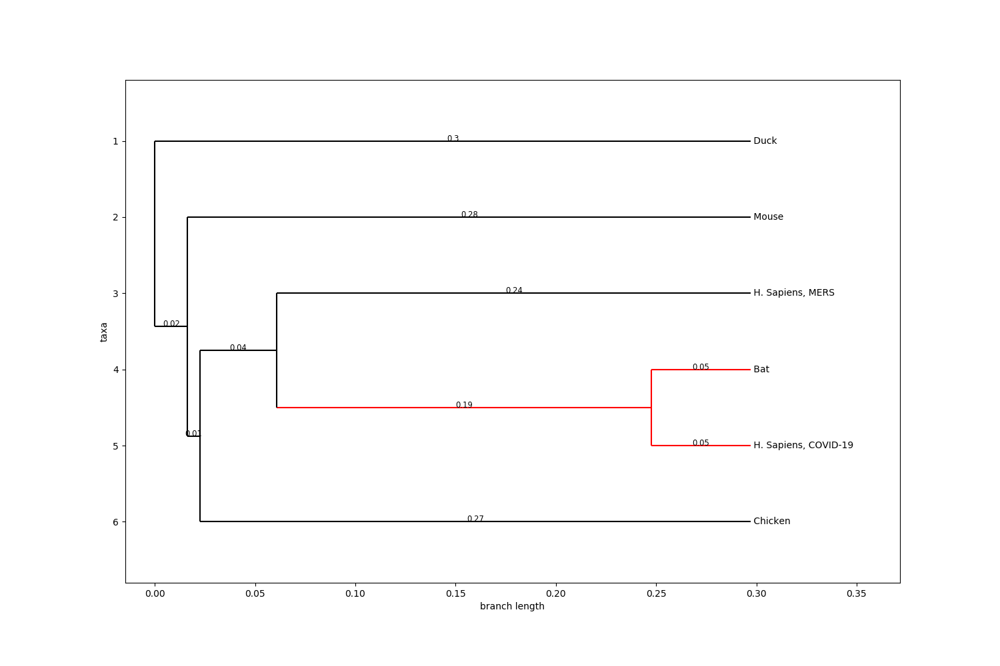
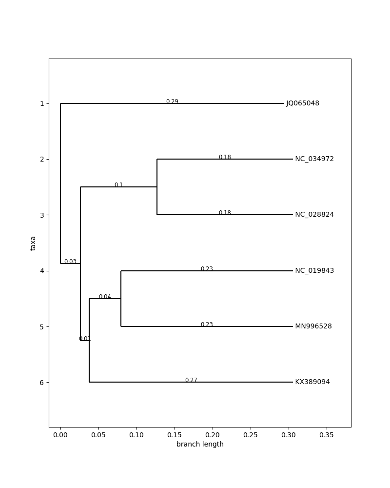

# covid_sequence

Analysis of the genetic sequence of the Severe acute respiratory syndrome coronavirus 2 (SARS-CoV-2) compared with other viruses from the same familly (Coronaviridae) in diferent hosts.
We will use clustal Omega that use seeded guide trees and HMM profile-profile techniques to generate alignments between multiple sequence. From this alignement a distance matrix can be extracted and used to generate the phylogenetic tree.

**IDs-Hosts**   
* MN996528 :  H. Sapiens (Human SARS-CoV-2)   
* NC_019843: H.Sapiens (Human MERS-CoV)   
* JQ065048:   anatidae (ducks, geese and swans)   
* MG772934:  rhinolophus (horseshoe bats)  
* NC_034972	Apodemus chevrieri (Rodent)
* KX38909:    Gallus gallus (Chicken) 

The sequences data (fasta files) can be found in the online public library: https://www.ncbi.nlm.nih.gov/labs/virus/vssi/

The red branche represents the SARS-CoV-2 with it's closest relative (Horseshoe bat host)

 
 

Next we explore different samples of the SARS-CoV-2 taken from several (human) hosts in different countries. The results are displayed on the following phylogenetic tree:

# Dependencies:

* Biopython
* clustral (for alignement) Note: alignement can also be performed directly on https://www.ncbi.nlm.nih.gov/labs/virus/vssi/ before downloading the sequences.
